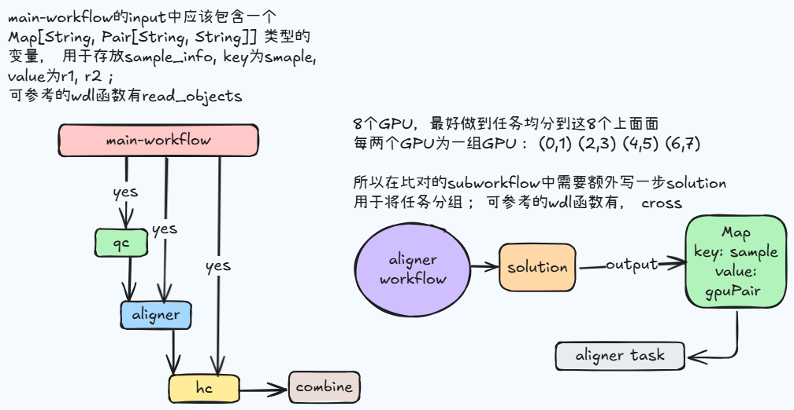
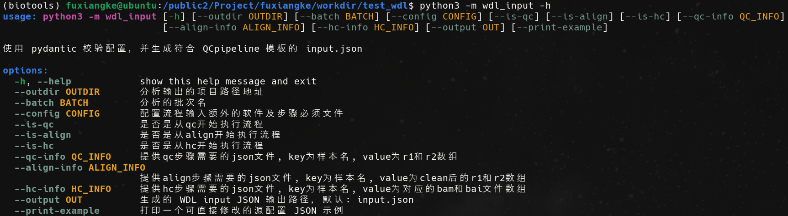

# scaq

## WDL流程

### 流程图



### 流程使用

1. 配置文件准备
   
   ```
   {
       "snp_stat": "/public/work/Pipline/GATK/bin/snp_stat.py",
       "bgzip": "/public/ubuntu/Software/htslib-1.19/bin/bgzip",
       "ref": "/public/work/Project/bijinpeng_zhongzhi/ji/0.fa/Gallus_gallus.bGalGal1.mat.broiler.GRCg7b.dna.toplevel.fa",
       "samtools": "/public/work/Personal/bijinpeng/miniforge3/envs/samtools/bin/samtools",
       "fastp_stat": "/public2/Project/fuxiangke/workdir/local_bin/parse_fastp.py",
       "bcftools": "/public/ubuntu/Software/bcftools-1.19/bin/bcftools",
       "fastp": "/public/work/Software/fastp_1.0/fastp",
       "Rscript": "/public/home/zhangjibin/miniconda3/bin/Rscript",
       "popSNP_SNPStat": "/public/work/Pipline/GATK/bin/popSNP_SNPStat.v2.r",
       "chr_list": "/public2/Project/fuxiangke/workdir/test_wdl/chr.list",
       "parallel": "/usr/local/bin/parallel",
       "fai": "/public/work/Project/bijinpeng_zhongzhi/ji/0.fa/Gallus_gallus.bGalGal1.mat.broiler.GRCg7b.dna.toplevel.fa.fai",
       "py": "/public/home/zhangjibin/miniconda3/bin/python3"
   }
   ```
2. 输入文件准备

```
{
    "300217-1": [
        "/public2/QC/QC_auto/project_dir/20260210_05/QY2025121803-01/QY2025121803-01_sequence_result/results/CleanData/300217-1_1.clean.fq.gz",
        "/public2/QC/QC_auto/project_dir/20260210_05/QY2025121803-01/QY2025121803-01_sequence_result/results/CleanData/300217-1_2.clean.fq.gz"
    ],
    "300217-2": [
        "/public2/QC/QC_auto/project_dir/20260210_05/QY2025121803-01/QY2025121803-01_sequence_result/results/CleanData/300217-2_1.clean.fq.gz",
        "/public2/QC/QC_auto/project_dir/20260210_05/QY2025121803-01/QY2025121803-01_sequence_result/results/CleanData/300217-2_2.clean.fq.gz"
    ],
    "300509-1": [
        "/public2/QC/QC_auto/project_dir/20260210_05/QY2025121803-01/QY2025121803-01_sequence_result/results/CleanData/300509-1_1.clean.fq.gz",
        "/public2/QC/QC_auto/project_dir/20260210_05/QY2025121803-01/QY2025121803-01_sequence_result/results/CleanData/300509-1_2.clean.fq.gz"
    ],
    "300509-2": [
        "/public2/QC/QC_auto/project_dir/20260210_05/QY2025121803-01/QY2025121803-01_sequence_result/results/CleanData/300509-2_1.clean.fq.gz",
        "/public2/QC/QC_auto/project_dir/20260210_05/QY2025121803-01/QY2025121803-01_sequence_result/results/CleanData/300509-2_2.clean.fq.gz"
    ],
    "300848-1": [
        "/public2/QC/QC_auto/project_dir/20260210_05/QY2025121803-01/QY2025121803-01_sequence_result/results/CleanData/300848-1_1.clean.fq.gz",
        "/public2/QC/QC_auto/project_dir/20260210_05/QY2025121803-01/QY2025121803-01_sequence_result/results/CleanData/300848-1_2.clean.fq.gz"
    ],
    "300848-2": [
        "/public2/QC/QC_auto/project_dir/20260210_05/QY2025121803-01/QY2025121803-01_sequence_result/results/CleanData/300848-2_1.clean.fq.gz",
        "/public2/QC/QC_auto/project_dir/20260210_05/QY2025121803-01/QY2025121803-01_sequence_result/results/CleanData/300848-2_2.clean.fq.gz"
    ],
    "300904-1": [
        "/public2/QC/QC_auto/project_dir/20260210_05/QY2025121803-01/QY2025121803-01_sequence_result/results/CleanData/300904-1_1.clean.fq.gz",
        "/public2/QC/QC_auto/project_dir/20260210_05/QY2025121803-01/QY2025121803-01_sequence_result/results/CleanData/300904-1_2.clean.fq.gz"
    ],
    "300904-2": [
        "/public2/QC/QC_auto/project_dir/20260210_05/QY2025121803-01/QY2025121803-01_sequence_result/results/CleanData/300904-2_1.clean.fq.gz",
        "/public2/QC/QC_auto/project_dir/20260210_05/QY2025121803-01/QY2025121803-01_sequence_result/results/CleanData/300904-2_2.clean.fq.gz"
    ]
```

3. 运行脚本示例



4. 在后台服务mysql和cromwell都启动成功的情况下，向节点投递任务请求，此处使用第三方工具oliver进行投递
   
   ```
   oliver su -g 0313 -j test --dependencies /public2/Project/fuxiangke/pipeline/scaq/wdl/task.zip /public2/Project/fuxiangke/pipeline/scaq/wdl/pipeline.wdl input.json |tee -a wid.txt
   ```
   
   ```
   #查询running的workflow状态，所有的任务为-d， 详细情况查询命令参数即可, 以下把几个常用的命令罗列一下
   oliver st 0ca756b5-c588-4925-afc8-046f28980880 -rd
   oliver i 0ca756b5-c588-4925-afc8-046f28980880
   oliver k -w 0ca756b5-c588-4925-afc8-046f28980880
   ```

